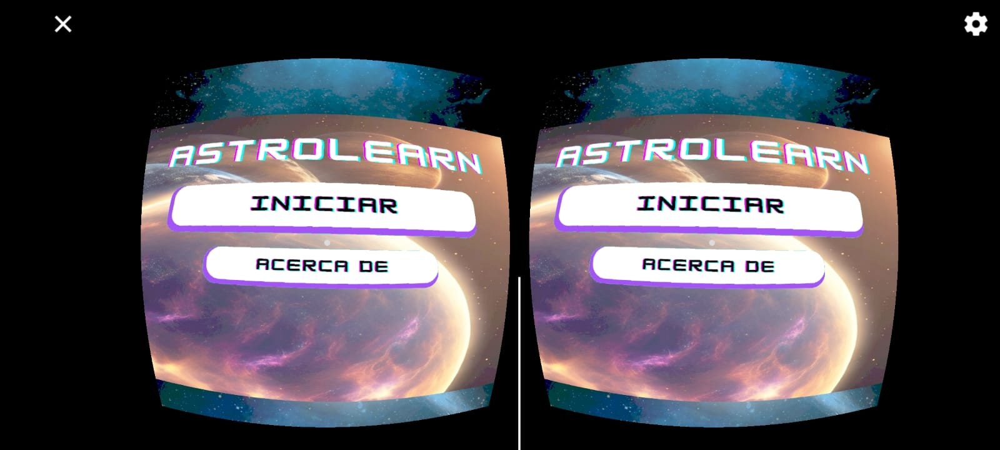
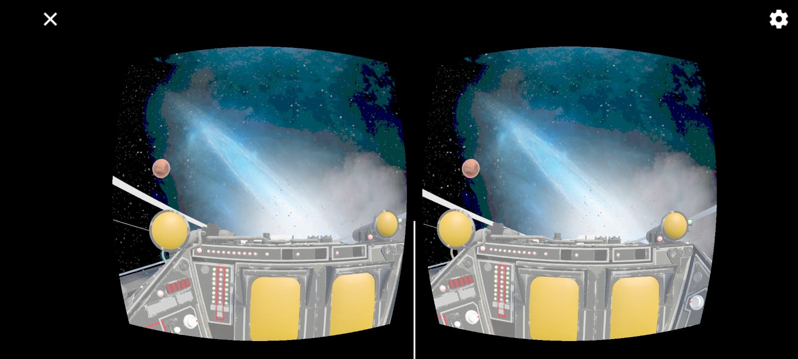
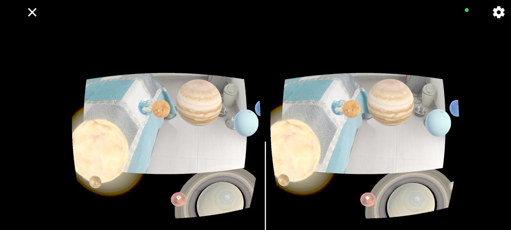
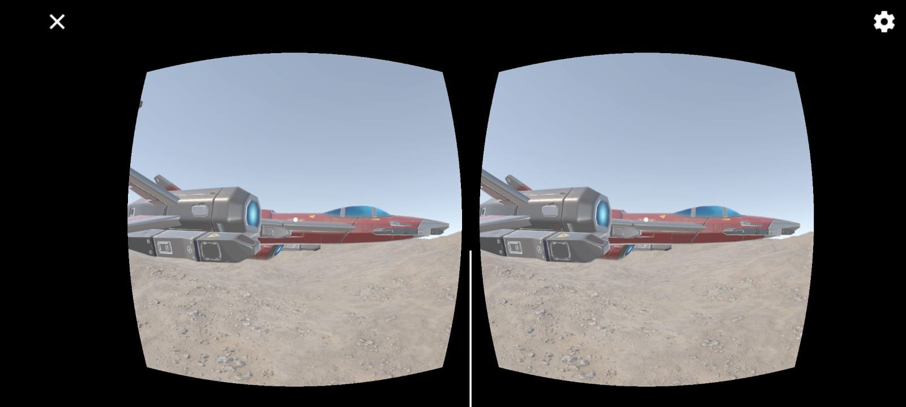

**🚀 AstroLearn: Exploración Espacial Inmersiva**

**🌟 Introducción al Proyecto**

El nombre AstroLearn nace de un juego de palabras entre Astro (objeto natural que existe en el espacio exterior) y Learn (aprender).

El objetivo principal de este proyecto es enseñar a estudiantes de primaria y secundaria sobre los astros de una manera interactiva e inmersiva. Para lograrlo, se implementan tecnologías de Realidad Mixta (combinando Realidad Virtual y Aumentada), permitiendo que los alumnos se sumerjan en una narrativa educativa donde pueden explorar planetas como Marte, Saturno y Júpiter.

**🛠️ Tecnología Utilizada**

Este demo fue desarrollado íntegramente en Unity, aprovechando herramientas específicas para cada modalidad de visualización:

Realidad Virtual (RV): Se utilizó el plugin de Google Cardboard para permitir una experiencia inmersiva de bajo costo, accesible para instituciones educativas.

Realidad Aumentada (RA): Se implementó Vuforia para la visualización de elementos digitales sobre el mundo real mediante el uso de marcadores.

**🛰️ Experiencia de Usuario**

La narrativa guía al estudiante a través de un viaje espacial donde se convierte en el capitán de su propia nave:

**🛸 Exploración de Planetas**

Al ingresar a un planeta (dentro de la nave), el estudiante puede explorar literalmente un modelo 3D detallado del astro para conocer más sobre sus características físicas y composición.

**🔍 Interacción Educativa**

Dentro de la nave o en la superficie del planeta, el usuario puede interactuar con objetos en su interior para desbloquear datos curiosos y aprender sobre astronomía de forma práctica.

**🪐 Características del Demo**

Inmersión Total: Gracias a la realidad virtual, el estudiante siente la escala real de los cuerpos celestes.

Interactividad Dinámica: Modelos 3D interactivos que permiten una comprensión profunda de cada planeta.

Accesibilidad: Diseñado para funcionar en dispositivos móviles, facilitando su uso en salones de clase sin necesidad de equipos de alta gama.
